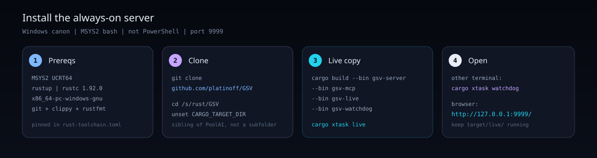
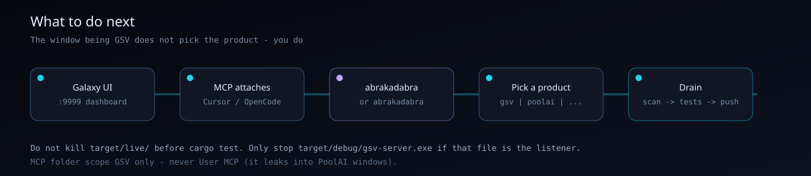
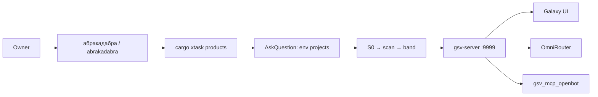

<p align="center">
  
</p>

<p align="center">
  <a href="https://github.com/platinoff/GSV/stargazers"></a>
  <a href="LICENSE"></a>
  <a href="https://www.rust-lang.org/"></a>
  <a href="https://github.com/sponsors/platinoff"></a>
  
</p>

<h1 align="center">GSV — Galaxy StarWalker Vision</h1>

<p align="center">
  <b>Rust-first vision server</b> for the work you already do: sprints, SLI, toolchain, ratio, and an OmniRouter AI proxy — plus the VDT kit that asks <i>which project on this machine</i> before it drains.
</p>

<p align="center">
  <a href="#-install-the-server">Install</a> ·
  <a href="#-what-to-do">What to do</a> ·
  <a href="#-boxes">Boxes</a> ·
  <a href="#-mcp--gsv_mcp_openbot">MCP</a> ·
  <a href="#-абракадабра">абракадабра</a> ·
  <a href="#-support--donate">Donate</a>
</p>

---

## Why GSV

GSV is a standalone crate (`S:\rust\GSV`, sibling of PoolAI — not a subfolder). Runtime, API, and boxes are **Rust**. The UI is thin HTML/CSS/JS glue. No Python product files. No Java.

| | |
|---|---|
| **Live dashboard** | `gsv-server` → [http://127.0.0.1:9999/](http://127.0.0.1:9999/) (SSE, offline-safe, Update instead of reload) |
| **Always-on** | `cargo xtask live` copies `target/debug` → `target/live` so `cargo test` does not kill the listener |
| **Ratio gate** | `gsv-loc-audit --stretch-96` — Rust **95–100%** (stretch ≥96%) |
| **VDT entry** | Open this folder in Cursor / OpenCode, type `абракадабра` or `abrakadabra` — the agent lists **environment projects**, then asks which one |
| **MCP** | [`gsv_mcp_openbot`](docs/gsv/GSV_MCP_OPENBOT.md) — one MCP server for OpenCode, Cursor, Grok CLI, and Grok Bot |

The hero / install / flow tiles below are **SMIL SVG** (no JS). GitHub plays `<animate>` inside an ``; that is why they move. Canon: [`docs/assets/presentations/README.md`](docs/assets/presentations/README.md).

---

## 🚀 Install the server

<p align="center">
  
</p>

**Canon shell is MSYS2 bash**, not PowerShell and not `cmd`. Port **9999** is canon (`8765` sits in a Hyper-V reserved range).

### 1. Prereqs (once)

- [MSYS2](https://www.msys2.org/) UCRT64
- [rustup](https://rustup.rs/) — this repo pins **rustc 1.92.0** `x86_64-pc-windows-gnu` in [`rust-toolchain.toml`](rust-toolchain.toml) (channel-only `1.92.0` follows rustup’s **msvc** host and the MSYS2 linker breaks)

```bash
# UCRT64 terminal
pacman -S --needed git mingw-w64-ucrt-x86_64-gcc
rustup toolchain install stable-x86_64-pc-windows-gnu
rustup component add rustfmt clippy --toolchain stable-x86_64-pc-windows-gnu
```

### 2. Clone

```bash
git clone https://github.com/platinoff/GSV.git /s/rust/GSV
cd /s/rust/GSV
```

Put the kit next to other products (`S:/rust/poolAI`, …). GSV is **not** a PoolAI subfolder.

### 3. PATH + first build

Every session, in MSYS2 bash:

```bash
export PATH="/c/Users/${USER:-${USERNAME}}/.cargo/bin:$HOME/.cargo/bin:/ucrt64/bin:/usr/bin:$PATH"
export RUSTUP_TOOLCHAIN="stable-x86_64-pc-windows-gnu"
cd /s/rust/GSV
unset CARGO_TARGET_DIR

cargo build --bin gsv-server --bin gsv-mcp --bin gsv-live --bin gsv-watchdog
cargo xtask live
```

`cargo xtask live` copies those bins into `target/live/` and keeps `gsv-server` bound to `:9999`. `cargo run --bin gsv-server` still works but **locks** `target/debug/` on Windows, so tests cannot rebuild.

### 4. Watchdog (second terminal)

```bash
export PATH="/c/Users/${USER:-${USERNAME}}/.cargo/bin:$HOME/.cargo/bin:/ucrt64/bin:/usr/bin:$PATH"
export RUSTUP_TOOLCHAIN="stable-x86_64-pc-windows-gnu"
cd /s/rust/GSV
unset CARGO_TARGET_DIR
cargo xtask watchdog
```

The watchdog probes `GET /api/health` and respawns the live copy if Cursor (or anything else) kills the supervisor. Optional persist: `cargo xtask watchdog-install`.

### 5. Open

Browser: [http://127.0.0.1:9999/](http://127.0.0.1:9999/).

You should see Galaxy chrome (RSS ticker, cards, sprint board). If the page is empty, the live binary is not the crate you just built — recopy with `cargo xtask live` after the build finishes.

**Do not** kill `target/live/gsv-server.exe` before `cargo test` / `cargo build`. Only stop `target/debug/gsv-server.exe` if *that* file is still the listener.

---

## 🧭 What to do

<p align="center">
  
</p>

| Step | You do | What happens |
|------|--------|----------------|
| 1 | Open [http://127.0.0.1:9999/](http://127.0.0.1:9999/) | Galaxy UI: Tracker, SLI, OmniRouter, vision maps, tickets |
| 2 | Keep this folder as the Cursor / OpenCode workspace | MCP auto-registers. Cursor talks HTTP `http://127.0.0.1:9999/mcp`. OpenCode / Grok spawn `target/live/gsv-mcp.exe` |
| 3 | Type **`абракадабра`** or **`abrakadabra`** in the agent chat | Agent runs `cargo xtask products` and **asks** which environment project to drain |
| 4 | Click a product | S0 disk → warnings-first scan → band → tests → **one** commit + push |
| 5 | Optional: Settings card | Bind Godfather Telegram (`data/gsv_settings.json` is gitignored). Never commit the bot token |

The window being GSV does **not** mean the drain target is GSV. Pick `gsv`, `poolai`, `omniroute`, or whatever the scan listed.



### Product tests (when draining **gsv**)

```bash
cargo fmt -- --check
cargo clippy --all-targets
cargo test                          # keep target/live/ running
cargo run --bin gsv-loc-audit -- --stretch-96
cargo run --bin gsv-http-stand-smoke
```

More commands: [`docs/gsv/GSV_RUST_DEV.md`](docs/gsv/GSV_RUST_DEV.md). Disk guard: `cargo xtask disk`.

---

## 📦 Boxes

Live panels served by Rust (`src/boxes/`), not a port of legacy `vision.js`.

| Box | Role |
|-----|------|
| **Tracker** | Last workflow: sprints, commands, timings |
| **SLI console** | Commands actually used + catalog from `src/bin/` · `cargo xtask` |
| **Toolchain** | rustc / cargo / clippy / MSYS2 inventory |
| **IDE** | OpenCode + Cursor sessions; pick which host you are on |
| **Update** | Bin rebuild → UI shows **Update** instead of reload; page survives offline |
| **Preview** | Rust syntax colors; path confined to the repo |
| **SLI terminal** | Agent-sent commands through a cargo/git allowlist |
| **Hooks** | Tests / bench against `target/` without a rebuild |
| **Ratio** | LOC audit → `data/rust_ratio.json` · `GET /api/ratio` |
| **OmniRouter** | OpenAI-compatible proxy across the provider catalog |
| **Vision** | Manifest, feed, maps, sprint board, speed + rust-diagnostics charts (SVG from Rust) |
| **Products / Watchdog / Settings / Tickets** | VDT picker, live supervisor, Godfather, claim board |

Localhost hardening is on: loopback bind, CSRF on mutating POST, CSP / nosniff / DENY / no-store, 256 KiB body cap. LAN bind needs `--allow-lan`.

---

## 🔌 MCP — `gsv_mcp_openbot`

One MCP server GSV owns; OpenCode / Cursor / Grok CLI / Grok Bot are **clients**.

```bash
# after cargo xtask live (copies gsv-mcp next to the server):
S:/rust/GSV/target/live/gsv-mcp.exe --repo-root S:/rust/GSV
```

- **Cursor** (this repo only): `.cursor/mcp.json` → `url: http://127.0.0.1:9999/mcp`. Never User MCP (`%USERPROFILE%/.cursor/mcp.json`) — it leaks into PoolAI windows.
- **OpenCode / Grok:** `.mcp.json` / `opencode.json` spawn **`target/live/gsv-mcp.exe`**, not `cargo run`.
- **55 tools** · **12 `gsv://` resources** · **3 prompts**. If the catalog looks stale after a drain, **restart Cursor** (agent refresh only resubscribes resources).

Canon: [`docs/gsv/GSV_MCP_OPENBOT.md`](docs/gsv/GSV_MCP_OPENBOT.md).

---

## ✨ абракадабра

GSV is also the **VDT kit** (rules, skills, drain loop). Same trigger in Latin: **`abrakadabra`**. Either spelling starts the same drain (`abracadabra` is the skill folder name).

1. Owner types `абракадабра` or `abrakadabra`.
2. Agent runs `cargo xtask products` — workspace folders **and** sibling git repos under `S:/rust`.
3. AskQuestion / OpenCode `question`: **which of those do we work with?**
4. S0 disk → warnings-first scan → drain ≤10 PH-S* → one commit + push.

Canon: [`docs/gsv/GSV_VDT_KIT.md`](docs/gsv/GSV_VDT_KIT.md) · registry (enrichment only): [`docs/gsv/PRODUCTS.md`](docs/gsv/PRODUCTS.md).

---

## 🧭 OmniRouter

Rust AI proxy (`src/boxes/omni/`). Config: `data/omni.toml` (keys redacted in the UI). Env overrides: `OMNI_<PROVIDER>_API_KEY`.

```
GET  /api/omni
GET  /api/omni/route
GET  /api/omni/v1/models
POST /api/omni/v1/chat/completions
```

Catalog: [`docs/gsv/GSV_OMNI_CATALOG.md`](docs/gsv/GSV_OMNI_CATALOG.md).

---

## 🗂 Layout

```
GSV/
├── src/bin/gsv_server.rs     live Galaxy UI + API
├── src/bin/gsv_xtask.rs      cargo xtask (product scripts in Rust)
├── src/bin/gsv_live.rs       always-on live-copy supervisor
├── src/bin/gsv_mds.rs        light memory / disk / speed app
├── benches/gsv_dev.rs        std benches (no shell harness)
├── src/boxes/                Tracker, SLI, OmniRouter, Vision, …
├── ui/                       thin HTML/CSS/JS glue
├── docs/gsv/                 architecture, boxes, roadmap, VDT kit
├── docs/assets/presentations/  SMIL SVG for GitHub README
└── .agents/skills/           abracadabra + generic VDT skills
```

---

## 📚 Docs

| Doc | What |
|-----|------|
| [`docs/gsv/README.md`](docs/gsv/README.md) | Docs index (this crate — not a PoolAI subfolder) |
| [`docs/gsv/GSV_ARCHITECTURE.md`](docs/gsv/GSV_ARCHITECTURE.md) | Server + boxes, Rust / wasm split |
| [`docs/gsv/GSV_SERVER.md`](docs/gsv/GSV_SERVER.md) | Endpoints, update, offline |
| [`docs/gsv/GSV_BOXES.md`](docs/gsv/GSV_BOXES.md) | Box spec |
| [`docs/gsv/GSV_RUST_DEV.md`](docs/gsv/GSV_RUST_DEV.md) | `cargo xtask` catalog |
| [`docs/gsv/GSV_TECH_ROADMAP.md`](docs/gsv/GSV_TECH_ROADMAP.md) | Sprint order |
| [`docs/gsv/GSV_ALWAYS_ON_UI.md`](docs/gsv/GSV_ALWAYS_ON_UI.md) | Always-on server, chrome, fingerprints |
| [`docs/gsv/GSV_VDT_KIT.md`](docs/gsv/GSV_VDT_KIT.md) | Shared kit vs product |
| [`docs/gsv/GSV_MCP_OPENBOT.md`](docs/gsv/GSV_MCP_OPENBOT.md) | MCP plan |
| [`docs/GSV_ROLES.md`](docs/GSV_ROLES.md) | Owner / orchestrator / subagents |
| [`docs/assets/presentations/README.md`](docs/assets/presentations/README.md) | Why README animation is SMIL |

---

## ❤️ Support / Donate

GSV is MIT and maintained in the open. If the dashboard or the kit saves you a session, here is how to keep it independent — pick whatever fits. Sponsorship never changes routing or drain priority.

<p align="center">
  <a href="https://github.com/platinoff/GSV/stargazers"></a>
  <a href="https://github.com/sponsors/platinoff"></a>
</p>

| | |
|---|---|
| ⭐ **Star** | Free, and it actually helps people find the repo |
| 🐙 **[GitHub Sponsors](https://github.com/sponsors/platinoff)** | One-off or monthly · [github.com/sponsors/platinoff](https://github.com/sponsors/platinoff) |
| 🐛 **Issues** | Bugs and ideas: [github.com/platinoff/GSV/issues](https://github.com/platinoff/GSV/issues) |

---

## License

[MIT](LICENSE) · [github.com/platinoff/GSV](https://github.com/platinoff/GSV)
