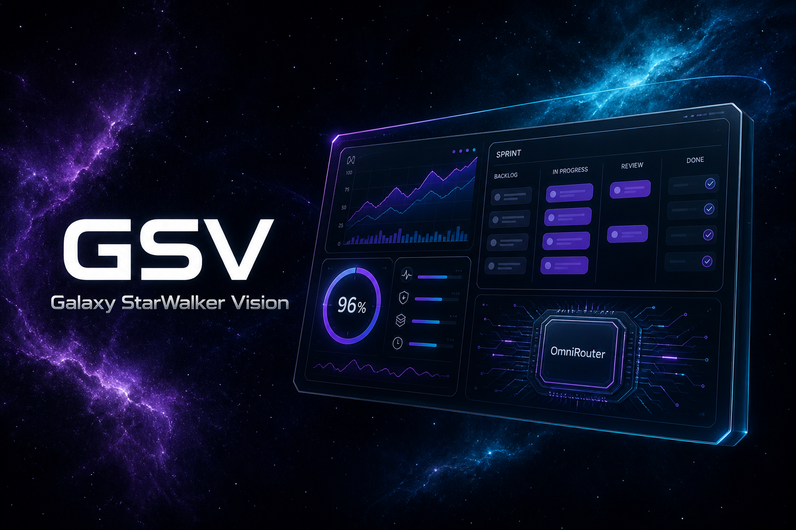
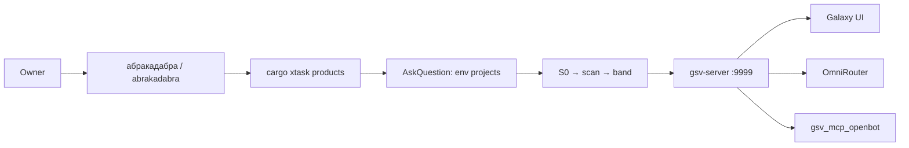
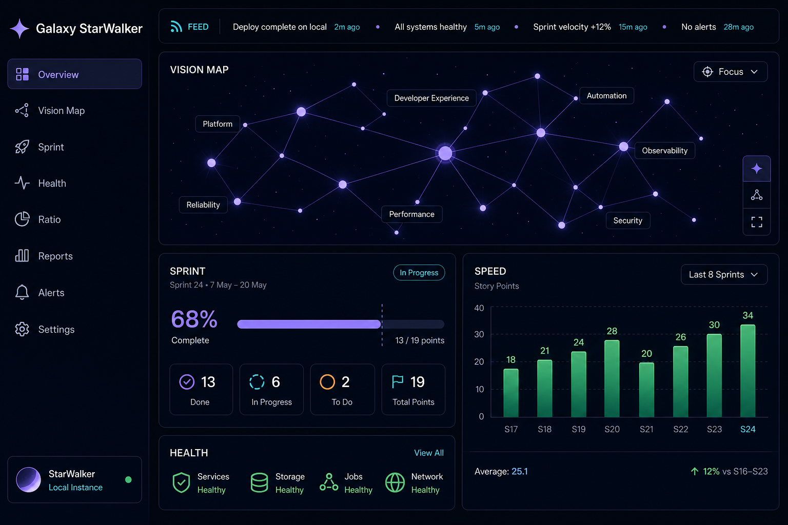
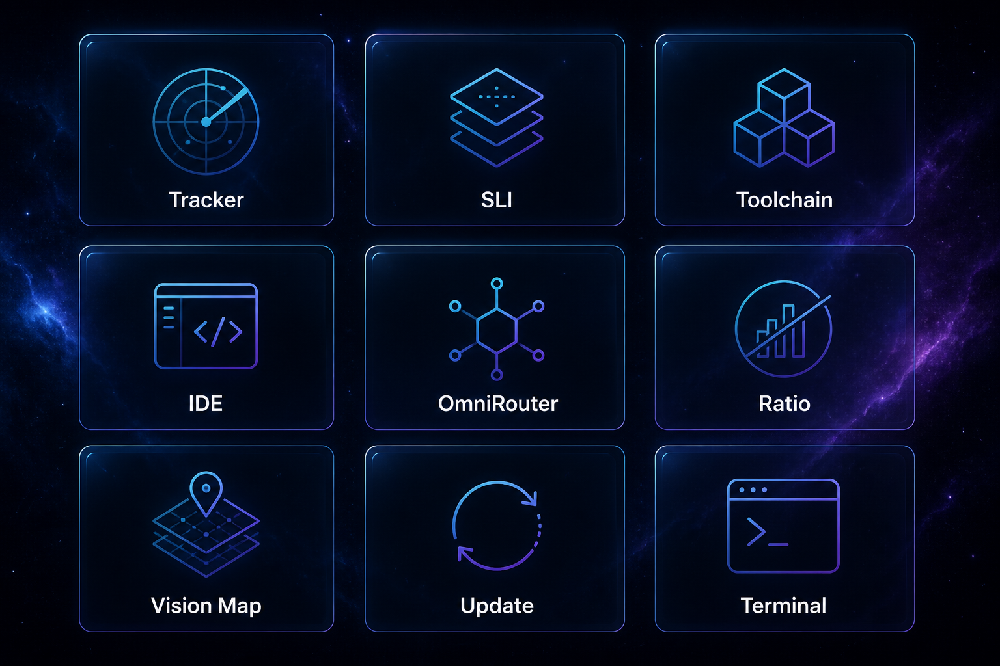

<p align="center">
  
</p>

<p align="center">
  <a href="https://github.com/platinoff/GSV/stargazers"></a>
  <a href="LICENSE"></a>
  <a href="https://www.rust-lang.org/"></a>
  <a href="https://github.com/sponsors/platinoff"></a>
  
</p>

<h1 align="center">GSV — Galaxy StarWalker Vision</h1>

<p align="center">
  <b>Rust-first vision server</b> for the work you already do: sprints, SLI, toolchain, ratio, and an OmniRouter AI proxy — plus the VDT kit that asks <i>which project on this machine</i> before it drains.
</p>

<p align="center">
  <a href="#-quick-start">Quick start</a> ·
  <a href="#-presentations">Presentations</a> ·
  <a href="#-boxes">Boxes</a> ·
  <a href="#-omnirouter">OmniRouter</a> ·
  <a href="#-абракадабра">абракадабра / abrakadabra</a> ·
  <a href="#-support--donate">Donate</a>
</p>

---

## Why GSV

GSV is a standalone crate (`S:\rust\GSV`, sibling of PoolAI — not a subfolder). Runtime, API, and boxes are **Rust**. The UI is thin HTML/CSS/JS glue. No Python product files. No Java.

| | |
|---|---|
| **Live dashboard** | `gsv-server` → [http://127.0.0.1:9999/](http://127.0.0.1:9999/) (SSE, offline-safe, Update instead of reload) |
| **Ratio gate** | `gsv-loc-audit --stretch-96` — Rust **95–100%** (stretch ≥96%) |
| **VDT entry** | Open this folder in Cursor / OpenCode, type `абракадабра` or `abrakadabra` — the agent lists **environment projects**, then asks which one to work with |
| **MCP** | [`gsv_mcp_openbot`](docs/gsv/GSV_MCP_OPENBOT.md) — one MCP server for OpenCode, Cursor, Grok CLI, and Grok Bot |



---

## 🎬 Presentations

Click a tile. These are the product shots for GitHub — the live UI is still the server on port **9999**.

<p align="center">
  <a href="docs/assets/presentations/gsv-galaxy-ui.png">
    
  </a>
  <a href="docs/assets/presentations/gsv-boxes.png">
    
  </a>
</p>

| Tile | What you are looking at |
|------|-------------------------|
| **Hero** | Vision dashboard + sprint board + 96% ratio ring + OmniRouter |
| **Galaxy UI** | Sidebar, RSS ticker, node map, sprint + speed chrome |
| **Boxes** | Tracker · SLI · Toolchain · IDE · Products · OmniRouter · Ratio · Vision Map · Update · Terminal |

Made a walkthrough of GSV? Open an [issue](https://github.com/platinoff/GSV/issues) with the link and we will hang it here.

---

## 🚀 Quick start

MSYS2 bash (not PowerShell):

```bash
export PATH="/c/Users/${USER:-${USERNAME}}/.cargo/bin:$HOME/.cargo/bin:/ucrt64/bin:/usr/bin:$PATH"
export RUSTUP_TOOLCHAIN="stable-x86_64-pc-windows-gnu"
cd /s/rust/GSV
unset CARGO_TARGET_DIR

cargo build --bin gsv-server --bin gsv-live --bin gsv-watchdog
cargo xtask live                 # copies target/debug → target/live, loop restart
# other terminal:
cargo xtask watchdog             # keep :9999 up if the live process dies
```

Open [http://127.0.0.1:9999/](http://127.0.0.1:9999/). The supervisor copies `target/debug/gsv-server.exe` → `target/live/` so `cargo test` / `cargo build` do not lock the listener. `gsv-watchdog` probes `/api/health` and respawns the live copy if Cursor (or anything else) kills the supervisor. `cargo run --bin gsv-server` still works but **locks** `target/debug/` on Windows.

```bash
cargo fmt -- --check
cargo clippy --all-targets
cargo test                          # keep target/live/ running; do not lock debug exe as listener
cargo run --bin gsv-loc-audit -- --stretch-96
cargo run --bin gsv-http-stand-smoke
```

**Port 9999** is canon. `8765` sits in a Hyper-V reserved range.

---

## 📦 Boxes

Live panels served by Rust (`src/boxes/`), not a port of legacy `vision.js`.

| Box | Role |
|-----|------|
| **Tracker** | Last workflow: sprints, commands, timings |
| **SLI console** | Commands actually used + catalog from `src/bin/` · `cargo xtask` |
| **Toolchain** | rustc / cargo / clippy / MSYS2 inventory |
| **IDE** | OpenCode + Cursor sessions; pick which host you are on |
| **Update** | Bin rebuild → UI shows **Update** instead of reload; page survives offline; metrics resync |
| **Preview** | Rust syntax colors; path confined to the repo |
| **SLI terminal** | Agent-sent commands through a cargo/git allowlist |
| **Hooks** | Tests / bench against `target/` without a rebuild |
| **Ratio** | LOC audit → `data/rust_ratio.json` · `GET /api/ratio` |
| **OmniRouter** | OpenAI-compatible proxy across the provider catalog |
| **Vision** | Manifest, feed, maps, sprint board, speed + rust-diagnostics charts (SVG from Rust) |

Localhost hardening is on: loopback bind, CSRF on mutating POST, CSP / nosniff / DENY / no-store, 256 KiB body cap. LAN bind needs `--allow-lan`.

---

## 🧭 OmniRouter

Rust AI proxy (`src/boxes/omni/`). Catalog (Aug 2026): GPT 5.2 · GPT 5.2 Codex · Claude Opus 4.5 · Claude Sonnet 4.5 · Gemini 3 Pro · MiniMax M2.1, plus DeepSeek / Kimi / GLM / Qwen and free hosts (OpenRouter, Groq, Cerebras, NVIDIA, Hugging Face).

```
GET  /api/omni
GET  /api/omni/route
GET  /api/omni/v1/models
POST /api/omni/v1/chat/completions
```

Config: `data/omni.toml` (keys redacted in the UI). Env overrides: `OMNI_<PROVIDER>_API_KEY`.

---

## ✨ абракадабра

GSV is also the **VDT kit** (rules, skills, drain loop). Opening this folder does **not** mean the product is GSV.

Same trigger in Latin: **`abrakadabra`**. Either spelling starts the same drain (`abracadabra` is the skill folder name).

1. Owner types `абракадабра` or `abrakadabra`.
2. Agent runs `cargo xtask products` — workspace folders **and** sibling git repos under `S:/rust` (today that is GSV, PoolAI, omniroute, …).
3. AskQuestion / OpenCode `question`: **which of those do we work with?**
4. S0 disk → warnings-first scan → drain ≤10 PH-S* → one commit + push.

Canon: [`docs/gsv/GSV_VDT_KIT.md`](docs/gsv/GSV_VDT_KIT.md) · registry (enrichment only): [`docs/gsv/PRODUCTS.md`](docs/gsv/PRODUCTS.md).

---

## 🔌 MCP — `gsv_mcp_openbot`

One MCP server GSV owns; OpenCode / Cursor / Grok CLI / Grok Bot are **clients**.

```bash
cargo run --quiet --bin gsv-mcp
```

Auto-register: `.mcp.json` · `.cursor/mcp.json` · `opencode.json` · `.grok/config.toml`. HTTP twin: `GET`/`POST`/`DELETE http://127.0.0.1:9999/mcp` (loopback; LAN needs `--allow-lan`; `Accept: text/event-stream` flushes notifications as SSE; `initialize` issues `Mcp-Session-Id`). Galaxy card: `/api/ui/card/mcp`. **36 tools** + **10 `gsv://` resources** + **3 prompts** + **logging** + **completions** + **subscribe** + **SSE** + **HTTP sessions**. Band **157**: OmniRouter shared catalog + quota timers (`gsv_omni_route`) — [`GSV_OMNI_CATALOG.md`](docs/gsv/GSV_OMNI_CATALOG.md). Band **156**: streaming token usage + `cargo xtask git` / `cargo xtask tunnel` (owner opt-in) — [`GSV_MCP_OPENBOT.md`](docs/gsv/GSV_MCP_OPENBOT.md).

Canon: [`docs/gsv/GSV_MCP_OPENBOT.md`](docs/gsv/GSV_MCP_OPENBOT.md).

---

## 🗂 Layout

```
GSV/
├── src/bin/gsv_server.rs     live Galaxy UI + API
├── src/bin/gsv_xtask.rs      cargo xtask (product scripts in Rust)
├── src/bin/gsv_live.rs       always-on live-copy supervisor
├── benches/gsv_dev.rs        std benches (no shell harness)
├── src/boxes/                Tracker, SLI, OmniRouter, Vision, …
├── ui/                       thin HTML/CSS/JS glue
├── docs/gsv/                 architecture, boxes, roadmap, VDT kit
├── docs/assets/presentations/  README shots
└── .agents/skills/           abracadabra + generic VDT skills
```

---

## 📚 Docs

| Doc | What |
|-----|------|
| [`docs/gsv/GSV_ARCHITECTURE.md`](docs/gsv/GSV_ARCHITECTURE.md) | Server + boxes, Rust / wasm split |
| [`docs/gsv/GSV_SERVER.md`](docs/gsv/GSV_SERVER.md) | Endpoints, update, offline |
| [`docs/gsv/GSV_BOXES.md`](docs/gsv/GSV_BOXES.md) | Box spec |
| [`docs/gsv/GSV_TECH_ROADMAP.md`](docs/gsv/GSV_TECH_ROADMAP.md) | Sprint order (always-on 143–147 ✅) |
| [`docs/gsv/GSV_ALWAYS_ON_UI.md`](docs/gsv/GSV_ALWAYS_ON_UI.md) | Always-on server, chrome, products, fingerprints |
| [`docs/gsv/GSV_VDT_KIT.md`](docs/gsv/GSV_VDT_KIT.md) | Shared kit vs product |
| [`docs/gsv/GSV_MCP_OPENBOT.md`](docs/gsv/GSV_MCP_OPENBOT.md) | MCP plan |
| [`docs/GSV_ROLES.md`](docs/GSV_ROLES.md) | Owner / orchestrator / subagents |

---

## ❤️ Support / Donate

GSV is MIT and maintained in the open. If the dashboard or the kit saves you a session, here is how to keep it independent — pick whatever fits. Sponsorship never changes routing or drain priority.

<p align="center">
  <a href="https://github.com/platinoff/GSV/stargazers"></a>
  <a href="https://github.com/sponsors/platinoff"></a>
</p>

| | |
|---|---|
| ⭐ **Star** | Free, and it actually helps people find the repo |
| 🐙 **[GitHub Sponsors](https://github.com/sponsors/platinoff)** | One-off or monthly · [github.com/sponsors/platinoff](https://github.com/sponsors/platinoff) |
| 🐛 **Issues** | Bugs and ideas: [github.com/platinoff/GSV/issues](https://github.com/platinoff/GSV/issues) |

---

## License

[MIT](LICENSE) · [github.com/platinoff/GSV](https://github.com/platinoff/GSV)
