<p align="center">
  
</p>

<p align="center">
  <a href="../../LICENSE"></a>
  <a href="https://www.rust-lang.org/"></a>
  <a href="https://github.com/sponsors/platinoff"></a>
  
</p>

# Telenetis — Telegram Mini App + Bot for GSV Godfather

Standalone Rust (Axum 0.8, Tokio) server on **port 9800** that bridges the GSV Godfather channel to a Telegram Mini App.

> **Production deploy:** see [`ops.md`](ops.md) — Docker, bare-metal systemd,
> Windows always-on supervisor, env matrix, and the post-boot verification.

## Architecture

```
GSV (9999)  <--HTTP-->  Telenetis (9800)  <--HTTPS-->  Telegram Bot API
              bus v1 poll (5s)                webhook POST /webhook
              tickets sync                     inline keyboard web_app
              WS/SSE broadcast  <--WS-->  Mini App UI (board/flows/roles)
```

- **Config** (`src/config.rs`): `TELENETIS_BOT_TOKEN`, `TELENETIS_GSV_URL` (default 9999), `TELENETIS_PORT` (9800), `TELENETIS_JAIL_ID`, `TELENETIS_GODFATHER_CHANNEL_ID`, `TELENETIS_WEBHOOK_URL`, `TELENETIS_WEBHOOK_SECRET` (optional webhook `secret_token`; inbound `/webhook` must echo it or is rejected 403).
- **AppState** (`src/state.rs`): `bus_queue`, `presence`, `tickets`, `flows` (cap 1000) + `broadcast::Sender<FlowEvent>` for WS/SSE. Role directory is wired in and persisted to `data/roles.jsonl` (`TELENETIS_ROLES_FILE` overrides the path).
- **GSV client** (`src/gsv/client.rs`): `/api/health`, `/api/tickets/list`, `/api/tickets/presence`, `/api/telegram/status`, `/api/telegram/bus`.
- **Bus** (`src/gsv/bus.rs`): v1 envelope `{v,kind,body,from,ts,data}` parse/format.
- **Poll loop** (`src/gsv/poll.rs`): `spawn_poll_loop` every 5s → `handle_bus_value` → `push_bus` + broadcast `FlowEvent`.
- **Bot** (`src/bot/telegram.rs`): `send_message`, `send_mini_app` (inline keyboard `web_app`), `answer_callback`, `set_webhook`.
- **Commands** (`src/bot/commands.rs`): `/start /status /board /flows /roles /help`.
- **Webhook** (`src/bot/webhook.rs`): `POST /webhook` classifies `message | callback_query | my_chat_member`, pushes `FlowEvent`.
- **Streams** (`src/stream/ws.rs` + `sse.rs`): `GET /ws` (WebSocket) + `GET /events` (SSE) from `flows_tx`.
- **Roles** (`src/roles/store.rs`): `Host|Mate|Guest|Observer` — `RoleStore` (assign/list/remove/get, persist/load JSONL). Wired into `AppState` (`roles`), served at `GET /api/roles` + `POST /api/roles` (assign) + `POST /api/roles/remove` (revoke, initData-checked), included in `/api/snapshot` as `roles`, and surfaced by the bot `/roles` command. Mutations persist to `data/roles.jsonl` (default; `TELENETIS_ROLES_FILE` overrides). + **Timezone** (`tz.rs`) via `chrono-tz`.
- **Security** (`src/security/auth.rs`): `MAX_BODY_BYTES 64 KiB`, `csrf_check`, `security_headers` (nosniff/no-store/CSP).
- **Security** (`src/security/initdata.rs`): Telegram Mini App `initData` HMAC-SHA256 verification (secret key HMAC `WebAppData`, `auth_date` freshness, constant-time compare) — guards `/api/verify` + all `/api/board/*` actions.
- **Actions** (`src/actions.rs`): `BoardAction` (Claim/Done/Error/Reclaim) + `available_actions(status)` + body parsing + GSV forward; `/api/board/claim|done|error|reclaim` POST routes forward on behalf of the verified Mini App user to GSV `/api/tickets/*`.
- **UI** (`src/ui/mod.rs`): `GET /`, `/app`, `/board`, `/flows`, `/roles`, `/probe`, `/tensor`, `/health`, `/api/status`, `/api/tickets`, `/api/roles`, `/api/flows`, `/api/snapshot?lang=`, `/api/mini-app/i18n`, `/api/live/config`, `/api/verify`, `/api/board/*`, `/api/edge/tensor/config`, `/vendor/*`, `/models/*`, `/static/app.css|js` (Askama templates in `src/ui/templates`).
- **Edge** (`src/edge.rs`): poolAI HTTP client + telegram-bindings read-model + VM/shard/chat surfaces; `lan_url`/`mini_app_base` keep phone-reachable URLs off loopback. The `/edge/upstream/*` reverse proxy gates POSTs (valid initData, or direct loopback/LAN callers with no forwarding headers); GETs stay open.
- **WebGPU probe** (`src/ui/webgpu.rs` + `templates/probe.html` + `static/probe.js`): `/probe` runs `navigator.gpu.requestAdapter()` on the phone (adapter info + allocation limits + `deviceMemory`); `POST /api/edge/webgpu` (initData-checked, body `{user, probe}`) validates server-side, resolves the caller's bound poolAI peer, and forwards a `class=webgpu` patch to GSV `POST /api/grid/profile` (unknown `ram_mb` stays 0 — never guessed). Profiles key per device (`{peer}-{adapter-slug}`), so two phones on one Telegram account never overwrite each other. Gates: run on A54 (Adreno) + Redmi 9 (Mali).
- **Browser tensor worker** (`templates/tensor.html` + `static/tensor.js`, PoC): `/tensor` loads a GGUF in the phone via wllama 3.5.1 ESM CDN (WebGPU `n_gpu_layers`, CPU fallback, OPFS-cached; Qwen2.5-1.5B default, 0.5B Redmi fallback) and serves `llama_chat` tasks from the bound peer queue through the `/edge/upstream/poolai` reverse proxy (poll → run → complete; non-chat tasks re-queued untouched since poll pops). Manual self-test box reports tok/s without touching the queue. PC pollers race for the same queue during the PoC. Custom RAM cache bypasses the OPFS requirement (HTTP LAN + old WebViews); downloads persist to IndexedDB with pause/resume + speed stats; WakeLock holds the screen; Start auto-loads the model when needed. **Disk storage**: per-row Save drops the GGUF into the phone Download folder (survives restarts), File… loads it back via the system picker — no re-download, no cache involved.
- **Main** (`src/main.rs`): merges `ui + webhook + ws + sse` routers, spawns poll loop, binds `0.0.0.0:{port}`.

## Setup

```bash
export TELENETIS_BOT_TOKEN="123:ABC"
export TELENETIS_GSV_URL="http://127.0.0.1:9999"
export TELENETIS_PORT="9800"
export TELENETIS_JAIL_ID="telenetis-01"
export TELENETIS_GODFATHER_CHANNEL_ID="0"
export TELENETIS_WEBHOOK_URL="https://example.com/webhook" # optional
export TELENETIS_WEBHOOK_SECRET="change-me"                 # optional, recommended
cd telenetis
cargo run
```

## Telegram setup checklist (BotFather) — T1.1

1. `/newbot` → save the HTTP API token → `TELENETIS_BOT_TOKEN` in `.env` (never commit).
2. `/newapp` → title + description → Web App URL (placeholder first, prod HTTPS later).
3. Main Mini App link: `/myapps` → Edit link → `https://t.me/{bot}/{app}`.
4. Menu button: `/setmenubutton` (or the bot sets it itself via `setChatMenuButton`).
5. Webhook (if public HTTPS): `TELENETIS_WEBHOOK_URL` + `TELENETIS_WEBHOOK_SECRET`
   (inbound `/webhook` without the secret header is 403). No tunnel → long polling.
6. Groups/channels reject `web_app` buttons — there the bot sends a URL button
   (`send_url_button`) to the direct-link Mini App instead.

Details: [`ops.md`](ops.md), concept [`CONCEPT.md`](CONCEPT.md) §1.

## Commands (Telegram)

- `/start` — welcome + command list
- `/status` — bot status
- `/board` — ticket board link (Mini App)
- `/flows` — live flows view
- `/roles` — role planner
- `/probe` — WebGPU adapter probe page (phone GPU → hub profile)
- `/help` — same as /start

## API

- `GET /health` → `{status, service, version}`
- `GET /api/status` → `{online, jail_id, tickets_count, workers_online, recent_flows}`
- `GET /api/tickets` → `{tickets: [{id,title,status,product,claimed_by}]}`
- `GET /api/roles` → `{ok, roles: [{jail_id, role, assigned_at}]}` (role directory, sorted by jail_id; read is public like `/api/status`)
- `POST /api/roles` → assign/overwrite a role; `ActionQuery {initData, authDate}` + JSON `{jail_id, role: "host|mate|guest|observer"}`; initData HMAC-checked (403 on forged handshake, 400 on bad role)
- `POST /api/roles/remove` → revoke a role; `ActionQuery` + JSON `{jail_id}`; `{ok, removed, jail_id}`
- `GET /api/snapshot?lang=` → consolidated bundle (status + tickets + flows + workers + roles + i18n + live config); tickets carry server-authoritative `actions` + `body`
- `GET /api/mini-app/i18n?lang=` → `{lang, strings}` (en/uk/ru)
- `GET /api/live/config` → server-authoritative reconnect + keep-alive schedule
- `GET /api/verify?initData=&authDate=` → initData HMAC validation `{ok, error?}`
- `POST /api/board/claim|done|error|reclaim` → initData HMAC verify → forward to GSV (`ActionQuery {initData, authDate}` + JSON `{action, ticket_id, note}`)
- `GET /probe` → WebGPU probe page (adapter + limits, one tap per device)
- `POST /api/edge/webgpu` → initData-checked probe submit (`ActionQuery` + JSON `{user, probe}`); validates, resolves bound peer, forwards `class=webgpu` hub profile to GSV; `{ok, unsupported}` when the adapter is absent
- `GET /tensor` → browser tensor worker page (wllama runtime + poolAI task loop + self-test)
- `GET /torrents/{stem}.torrent` → bittorrent metainfo for a host model (1 MiB pieces, `url-list` webseed to this host, trackerless); the worker page downloads through it with HTTP fallback
- `GET /api/flows` → `{flows: [FlowEvent]}`
- `POST /webhook` → `"ok"` (Telegram update)
- `GET /ws` → WebSocket JSON `FlowEvent` stream
- `GET /events` → SSE `text/event-stream`
- `GET /tracker` → WS torrent signaling relay (WebTorrent announce/offer/answer for phone-to-phone P2P)
- `POST /api/testmode` + `GET /api/testmode` → host-test consent toggle (initData; identity from verified `user.id`)
- `GET /api/edge/testmode/peers` → opted-in user ids for the host harness (initData or direct LAN)

## Windows keep-live (band 228)

On Windows, `:9800` is kept alive by the **Telenetis live supervisor** exactly like GSV `:9999` — no manual `cargo run` needed:

```bash
cargo xtask telenetis-live   # builds/spawns telenetis-live (dedup if :9800 already answers)
```

- `telenetis/src/bin/telenetis_live.rs` copies `target/debug/telenetis.exe` → `target/live/telenetis.exe` (so `cargo test` / `cargo build` may overwrite debug without Windows file locks) and respawns the bot on exit.
- `cargo xtask live` / `gsv-live` also spawns it as a second child, so the GSV always-on supervisor carries Telenetis along.
- GSV's watchdog now **multi-probes** Telenetis on `GET /api/watchdog`: `telenetis_alive` (TCP `:9800`, 200 ms) + `telenetis_debug_newer` (supervisor debug→live parity). The Galaxy watchdog card shows both.

Docker / systemd / bare-metal Linux deploy stays in [`ops.md`](ops.md).

## Tests

```bash
cd telenetis
cargo fmt --all
cargo clippy --all-targets
cargo test
```

**290** unit tests + **4** live-supervisor tests + **4** integration tests
(`tests/integration_test.rs`) + **6** phone-emulator scenarios
(`tests/phone_emulator.rs`, `src/emu.rs`) = **304** total.

Phone emulator (T8): headless double of the Mini App client — lifecycle
(foreground/background/killed), disk-vs-cache storage, fresh `initData`
signer. Gate before real phones:
`cargo test --test phone_emulator`. It covers server contracts and byte
flows, NOT real WebView taps.

## Support / Donate

Telenetis is developed by the GSV kit family and lives inside the GSV repository. If it helps keep your Godfather channel coordinated, consider supporting the owner:

- 🐙 **GitHub Sponsors** — one-off or monthly: [github.com/sponsors/platinoff](https://github.com/sponsors/platinoff)
- ⭐ **Star:** <a href="https://github.com/platinoff/GSV/stargazers"></a>
- 🐛 **Issues / ideas:** [github.com/platinoff/GSV/issues](https://github.com/platinoff/GSV/issues)
- ☀️ **Solana (SOL):** `GcdgNtdE8NEk3z9sQ5jXv2tqguZjSYqPqNAtjsjPNJx8`

Sponsorship helps keep GSV + Telenetis + the registered ecosystem always-on.
